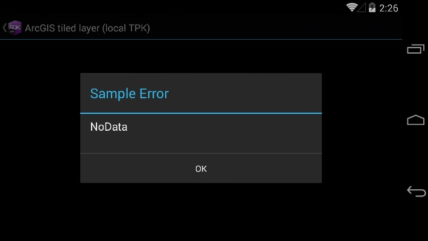

#ArcGIS tiled layer (local TPK)

This code example shows adding an ArcGISTiledLayer as an operational layer in a map. The ArcGISTileLayer is located as a file on the disc of the device.

### Instructions

